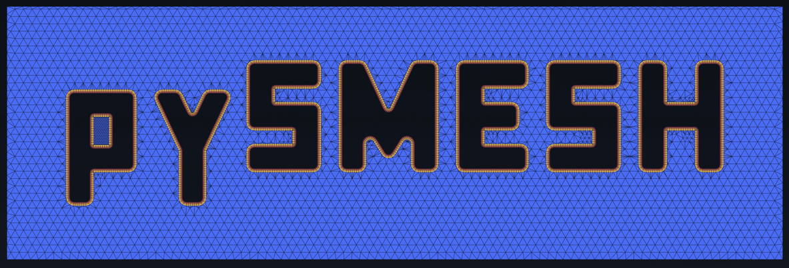

# pySMESH

[](https://pypi.org/project/pysmesh/)



Python bindings to SALOME SMESH and Open CASCADE (OCCT), packaged as one
self-contained Windows wheel. No SALOME platform. No CORBA. No GUI.

pySMESH gives a CFD or CAD preprocessing pipeline direct access to a
production meshing and geometry kernel, through plain NumPy arrays and BREP
bytes. It does not replace SALOME. It exposes the parts of SMESH and OCCT a
pipeline needs, as a normal `pip`-installable module.

Its core is SMESH's **structured meshing**: mapped quadrangle faces,
block-structured hexahedra, swept and extruded prisms, radial O-grids and
projected mesh patterns, with exact control of the node spacing on every
edge and boundary layers grown from named walls. A model is meshed per
sub-shape, so structured blocks and free or body-fitted regions share one
conformal mesh. See [Meshing capabilities](#meshing-capabilities).

Meta:

- **License:** LGPL-2.1-only (see [LICENSE](LICENSE), [NOTICE.md](NOTICE.md))
- **Platform:** Windows x64, CPython 3.11 to 3.14
- **Runtime dependencies:** NumPy. Nothing else. SMESH, NETGEN, OCCT, Boost and VTK all
  ship inside the wheel.

## What it covers

pySMESH covers three areas:

- **`Session`**: a stateful CAD modelling session. Build and edit a shape
  (primitives, booleans, fillets, chamfers, sweeps, healing). Every entity
  keeps a persistent id across every edit. See
  [CAD modelling](#cad-modelling).
- **`Mesher`**: SMESH's full meshing pipeline. Assign algorithms and
  hypotheses per sub-shape: the structured, body-fitted and free algorithms,
  the 1-D spacing laws and the boundary layers listed in
  [Meshing capabilities](#meshing-capabilities). Compute a mesh, then edit,
  query, and check its quality. It also accepts a mesh it did not build: a
  discrete body with no B-rep goes in as plain arrays. See
  [Mesh generation and editing](#mesh-generation-and-editing) and
  [Discrete meshes](#discrete-meshes-no-cad).
- **Standalone OCCT geometry operations**: STEP and IGES import/export,
  tessellation, offsets, distance and leak checks, point-in-solid
  classification, and geometry queries. See
  [Geometry operations](#geometry-operations).

Two entry points serve one-shot work outside a session. `compute_viscous_layers`
grows boundary-layer prisms on a surface mesh that you supply.
`unify_same_domain` wraps `ShapeUpgrade_UnifySameDomain` for B-rep face
merging that removes STEP import seams.

## Meshing capabilities

pySMESH binds SALOME SMESH `V9_16_0`: its algorithms, its hypotheses and its
assignment model. Each algorithm is a typed class in `pysmesh.mesher`, and
each hypothesis is a frozen dataclass whose fields are the SMESH parameters.
An algorithm and its hypotheses go on the whole model or on one sub-shape (a
solid, a face, an edge, a vertex). So one model can mix the families below.

### Structured meshing

These algorithms build structured meshes: each face or block is mapped onto
a logical grid, and the node spacing follows the edge discretisation exactly.

| Class | What it meshes |
|---|---|
| `Quadrangle2D` | A face with four logical sides, by a mapped (transfinite) grid. `QuadrangleParams` sets the corners, the base vertex of a three-sided face, the transition for unequal opposite sides, and enforced nodes. |
| `Hexa3D` | A block (a solid with six logical faces) into hexahedra in i, j, k order. `BlockRenumber` numbers the cells and nodes like a structured grid. |
| `CompositeHexa3D` | A block whose six logical sides are each made of several faces. |
| `Prism3D` | A prismatic solid, by extruding a source face's mesh through it, layer by layer. The source face may be meshed by any 2-D algorithm. |
| `RadialPrism3D` | An O-grid between an inner and an outer shell, such as a pipe wall. `NumberOfLayers` or `LayerDistribution` spaces the layers. |
| `RadialQuadrangle1D2D` | A disk or an annulus, by radial quadrangles. `NumberOfLayers2D` or `LayerDistribution2D` spaces the rings. |
| `QuadFromMedialAxis1D2D` | A thin face, by quadrangles built on its medial axis. |
| `HexaFromSkin3D` | A solid, from its existing all-quadrangle surface mesh. |
| `Projection1D`, `Projection2D`, `Projection1D2D`, `Projection3D` | An edge, face or solid, by copying the mesh pattern of a source shape. |

The 1-D discretisation drives every structured mesh. `Regular1D` takes one
spacing law per edge:

- `NumberOfSegments`: a fixed count, spaced uniformly, by a scale factor, by a
  density table, by a density expression, or by the beta law that clusters
  nodes towards a wall.
- `Arithmetic1D`, `Geometric1D`, `StartEndLength`: graded segments between
  stated lengths. `FixedPoints1D`: nodes at named positions.
- `reversed_edges` on each graded law makes a chain of edges grade in one
  direction, whatever the orientation of each edge.
- `Propagation` carries an edge's law to every opposite edge of a structured
  region. `PropagOfDistribution` carries its relative spacing instead.

```python
from pysmesh import Session, load_brep
from pysmesh.mesher import (BlockRenumber, Distribution, Hexa3D, Mesher, NumberOfSegments,
                            Propagation, Quadrangle2D, Regular1D, SubShape, SubShapeKind)

s = Session()
s.add_box(1.0, 2.0, 3.0)
mesher = Mesher(load_brep(s.export_handoff().brep))
mesher.assign(Regular1D())
mesher.assign(NumberOfSegments(count=10))
# Cluster 40 nodes towards one end of edge 1, and carry that spacing to its opposite edges.
wall = SubShape(SubShapeKind.EDGE, 1)
mesher.assign(NumberOfSegments(count=40, distribution=Distribution.BETA_LAW, beta=1.02), on=wall)
mesher.assign(Propagation(), on=wall)
mesher.assign(Quadrangle2D())
mesher.assign(Hexa3D())
mesher.assign(BlockRenumber())
report = mesher.compute()    # 40 x 10 x 10 = 4 000 hexahedra
```

### Boundary layers

Viscous layers grow from named walls, with the first layer, the growth factor
and the total thickness in a closed form (`first_layer_thickness`). There are
three ways to build them:

- **Inside a `Mesher`:** `ViscousLayers` on a solid, with `Hexa3D`,
  `CompositeHexa3D`, `PolyhedronPerSolid3D`, `Cartesian3D`, `Netgen3D` or
  `Netgen1D2D3D`. `ViscousLayers2D` on a face, with `Quadrangle2D`,
  `QuadFromMedialAxis1D2D`, `Mefisto2D`, `PolygonPerFace2D`, `Netgen2D` or `Netgen1D2D`.
  With NETGEN, prisms grow on the chosen walls and tetrahedra fill the rest. An
  algorithm that cannot build layers refuses them by name.
- **In two steps, with `ViscousLayerBuilder`:** `Mesher.shrink_geometry` returns
  the shape shrunk by the layer thickness. Mesh it with any algorithm, then
  `Mesher.add_layers` adds the layers onto the original shape.
- **On your own surface mesh:** `compute_viscous_layers` grows prisms on a
  classified surface mesh. See `examples/box_bl.py`.

### Body-fitted and free meshing

| Class | What it meshes |
|---|---|
| `Cartesian3D` | Any solid, by a body-fitted Cartesian grid: hexahedra inside, cut polyhedra at the wall. `CartesianParameters3D` sets the grid (spacing functions, explicit coordinates, axes, a fixed point) and the quanta that turn small cut cells into hexahedra. Takes viscous layers. |
| `Mefisto2D` | Any face, by free triangles sized by `MaxElementArea` or by `LengthFromEdges`. |
| `PolygonPerFace2D`, `PolyhedronPerSolid3D` | One polygon per face, one polyhedron per solid. |
| `Netgen1D2D3D`, `Netgen3D` | Any solid, by NETGEN tetrahedra: in one algorithm from the edges up, or from the mesh of its faces (pyramids join quadrangle faces). `NetgenParameters` sets the size, the fineness preset, local sizes per sub-shape, a chordal error and second order. Takes viscous layers. |
| `Netgen1D2D`, `Netgen2D` | Any face, by NETGEN triangles, or quad-dominant with `quad_allowed`. Takes viscous layers. |
| `NetgenRemesher2D` | A triangle surface with no CAD behind it, meshed again chart by chart, at its feature edges. See [Discrete meshes](#discrete-meshes-no-cad). |

Free 1-D sizing: `LocalLength`, `MaxLength`, `AutomaticLength`, and the
curvature-driven `Deflection1D` and `Adaptive1D`. `MaxElementVolume` bounds
3-D cells, and `QuadraticMesh` makes second-order elements. NETGEN (netgen 6.2.2101,
SALOME's NETGENPlugin `V9_16_0`) is built into `_core`; see the
[NETGEN guide](docs/documentation/guides/netgen.md).

### Reporting

`compute()` returns a `ComputeReport` with the element counts per sub-shape
and the warnings SMESH raised. A failed compute raises `PysmeshError` that
names each failed sub-shape and the reason: a missing algorithm, a missing
hypothesis, or the algorithm's own error. Hypotheses that conflict where
their sub-shapes meet are refused at `assign`, naming the shared sub-shape.

## Install

```bash
pip install pysmesh
```

That is the whole procedure. The wheel is self-contained: SMESH, OCCT, Boost
and VTK all ship inside it. NumPy is the only thing pip pulls in.

**Platform:** Windows x64, CPython 3.11 to 3.14. There is one wheel per
interpreter and none for other platforms. Pip picks the right one, and
refuses to install on anything unsupported rather than land something that
cannot import.

macOS and Linux are not built. The blocker is packaging, not the code: PyPI
requires Linux wheels to be `manylinux`-tagged, and this build resolves
Boost and VTK from conda-forge, which is a different ABI baseline. OCCT is
already built from source (`ci/build_occt.py`), but on Windows only.
Supporting Linux properly means building all three from source inside a
manylinux container. That is planned separately, not skipped by oversight.

Wheels are also attached to every
[GitHub Release](https://github.com/KRGulaj/pySMESH/releases), for pinning a
build by exact file.

> **Upgrading from 5.0:** 5.1.0 adds NETGEN and completes the boundary
> layers. No public name is removed. A few calls that returned a wrong mesh
> in silence now raise `PysmeshError`, for example a compute that leaves a
> sub-shape unmeshed. See the
> [changelog](https://github.com/KRGulaj/pySMESH/blob/main/CHANGELOG.md).

> **Upgrading from 4.x:** 5.0.0 moves to SMESH 9.16 and OCCT 8.0.1 and fixes
> the defects of 4.2.2. No public name is removed. Some results change: 1-D
> distributions, `Adaptive1D`, bounding boxes and default measures. Some calls
> that returned a bad shape or mesh in silence now raise `PysmeshError`. Read
> the [changelog](https://github.com/KRGulaj/pySMESH/blob/main/CHANGELOG.md)
> before you upgrade.

> **Upgrading from 3.x:** 4.0.0 removes the shared VTK requirement. Earlier
> versions linked the host environment's VTK and refused to import unless it
> was exactly 9.6.2. That constraint is gone. pySMESH now carries its own
> private VTK, so it no longer cares which VTK you have, or whether you have
> one at all. If you install with `--no-deps`, or gate on
> `_build_info.VTK_VERSION`, that check is now obsolete and always passes.

## Quick example

```python
import pysmesh
from pysmesh import Session
from pysmesh.session import EntityKind

s = Session()
s.add_box(3.0, 7.0, 11.0)
s.fillet(edge_ids=s.entities(EntityKind.EDGE), radius=0.5)

handoff = s.export_handoff()  # brep bytes + per-entity id arrays, ready for Mesher

mesher = pysmesh.Mesher(pysmesh.load_brep(handoff.brep))
mesher.assign(pysmesh.mesher.Regular1D())
mesher.assign(pysmesh.mesher.NumberOfSegments(count=8))
mesher.assign(pysmesh.mesher.Quadrangle2D())
mesher.assign(pysmesh.mesher.Hexa3D(), on=pysmesh.mesher.SubShape(
    pysmesh.mesher.SubShapeKind.SOLID, 1
))
mesher.compute()
mesh = mesher.mesh()
```

## CAD modelling

`Session` owns one live shape and gives every entity a persistent id, so
edits, undo, and mesh handoff all stay correct as the shape changes.

```python
from pysmesh import Session
from pysmesh.session import EntityKind

s = Session()
s.add_box(3.0, 7.0, 11.0)
s.fillet(edge_ids=s.entities(EntityKind.EDGE), radius=0.5)
mark = s.snapshot()          # O(1)
s.restore(mark)              # O(1)

handoff = s.export_handoff()  # brep bytes + per-entity id arrays, ready for Mesher
```

`Session` covers primitives, curve and surface construction, sweeps, booleans
with history, fillet and chamfer, transforms, healing, defeaturing,
imprinting, tessellation, and geometric queries. See
`src/pysmesh/session/__init__.py` for the full API.

Two queries answer the questions a feature filter asks. `surface_parameters`
reads a face's analytic parameters off its surface: a radius, a cone's
taper, a torus's two radii. `face_wires` splits a face's boundary into its
loops, so an inner loop (a hole) is distinguishable from the outer one. A
parameter the surface type does not define reads `NaN`, never a stand-in
value.

```python
import numpy as np

faces = s.entities(EntityKind.FACE)
params = s.surface_parameters(faces)

# every cylindrical face under 1 mm across: fillets and small bores
small = params.ids[(np.array(params.types) == "Cylinder") & (params.radius1 < 1.0)]

wires = s.face_wires(faces)
for row in np.flatnonzero(~wires.is_outer):        # one row per hole
    lo, hi = wires.edge_range[row]
    hole_edges = wires.edge_id[lo:hi]
```

Three queries answer about edges and about the space between entities.
`curve_geometry` is the curve-side `surface_parameters`: a line's direction, a
circle's or an ellipse's centre, plane normal and radii, with `NaN` on any
free-form curve. `curve_at` gives the point and unit tangent at each parameter
of one edge — along increasing parameter, never flipped for a reversed edge,
because an edge shared by two faces is FORWARD in one and REVERSED in the
other. `distance` is the exact minimum distance between any two entities, with
the witness point on each.

```python
edges = s.entities(EntityKind.EDGE)
curves = s.curve_geometry(edges)

# every circular edge under 1 mm across: the rims of small bores
is_circle = np.array(curves.type) == "Circle"
rims = curves.edge_id[is_circle & (curves.radius[:, 0] < 1.0)]

first, last = s.edge_parameter_bounds([edges[0]])[0]
sample = s.curve_at(edges[0], np.linspace(first, last, 32))
direction = sample.tangents[sample.defined]

# the clearance between two entities, with the witness point on each
gap = s.distance(faces[0], faces[2])   # gap.distance, gap.point_a, gap.point_b
```

## Mesh generation and editing

`Mesher` builds a volume or surface mesh from a shape, using SMESH's own
algorithm and hypothesis model. Assign an algorithm and its hypotheses to a
sub-shape. Different sub-shapes can use different algorithms. Compute the
mesh, then read it back as NumPy arrays.

```python
from pysmesh import load_brep
from pysmesh.mesher import Hexa3D, Mesher, NumberOfSegments, Quadrangle2D, Regular1D
from pysmesh.mesher import SubShape, SubShapeKind

mesher = Mesher(load_brep(handoff.brep))
mesher.assign(Regular1D())
mesher.assign(NumberOfSegments(count=8))
mesher.assign(Quadrangle2D())
mesher.assign(Hexa3D(), on=SubShape(SubShapeKind.SOLID, 1))
report = mesher.compute()
mesh = mesher.mesh()
```

Once a mesh exists:

- **Quality controls** measure and classify cells: aspect ratio, skew,
  warping, the scaled Jacobian, orientation, and more.
- **Groups** name sets of elements. A group survives edits, so a wall named
  on a coarse mesh is still the wall after conversion to second order.
- **The editor** smooths, merges coincident nodes, reorients cells, splits
  and fuses faces, splits volumes, converts between linear and quadratic,
  builds the missing boundary faces or edges, sews free borders, offsets a
  surface, and deletes elements and nodes.
- **Search** locates elements at a point, casts rays through the faces or
  the volume cells of the mesh, finds sharp edges, and classifies a point as
  inside or outside a closed surface.
- **The medial axis** of a face reports its centreline and local wall
  thickness. A face can also be decomposed into blocks or have a pattern
  mapped onto it.
- **Boundary layers** come in three forms; see
  [Boundary layers](#boundary-layers).

See `src/pysmesh/mesher/__init__.py` for the full model and
`src/pysmesh/_core.pyi` for the typed API.

## Discrete meshes (no CAD)

A `Mesher` does not need a shape. `Mesher()` starts empty and is filled from
arrays, which is how a body that never had a B-rep gets in: an imported STL,
OBJ or PLY, a shrink-wrap result, the boundary another mesher produced, or a
mesh read back from a file.

```python
from pysmesh import Mesher

mesher = Mesher.from_arrays(points, triangles)   # (N, 3) float64, (M, 3) row indices

# Divide the surface into patches. Without CAD faces, this is what a viewport picks on.
edges = mesher.sharp_edges(angle=40.0)
patches = mesher.separate_faces_by_edges(edges, name_prefix="patch_")

# Delete one patch. The report names every id that went, including the freed nodes.
gone = mesher.remove_elements(patches.at(2), free_nodes=True)
print(gone.elements, gone.nodes)
```

Four things are worth knowing:

- **Ids are the handle.** Nodes and elements keep their ids for as long as
  they exist, and nothing is ever renumbered. `add_nodes` and
  `add_elements` return the ids they created. `Mesher.from_mesh(mesh_data)`
  rebuilds a live mesh from a harvest and keeps every one of them, which is
  the way back from `read_gmf`.
- **A patch index is not stable. A patch group is.** Each call to
  `separate_faces_by_edges` re-derives the partition, so indices can shift
  once faces have been deleted. Passing `name_prefix` stores each patch as
  a group, and SMESH maintains that membership itself: a deleted element
  leaves the group, survivors keep their place.
- **The one algorithm it takes.** `NetgenRemesher2D`, on the whole mesh,
  meshes the triangles again with NETGEN, chart by chart. The new mesh
  replaces the old one.
- **What such a mesher cannot do.** Anything that resolves a sub-shape
  ordinal: `compute` with any other algorithm, `assign`/`unassign`,
  `add_group_on_shape`, the pattern mapping, `smooth(in_uv_space=True)`, and
  the `ElementsOnShape` and `Deflection2D` controls. Each refuses by name. Everything else, the
  editor, search, quality controls, groups by id or by filter, behaves
  identically. Check with `mesher.has_shape`.

## Geometry operations

Standalone Open CASCADE operations. All are headless (no VTK, no SMESH),
take and return BREP bytes and NumPy arrays, and key every result to the
same 1-based ordinals `Shape.faces()` / `.edges()` / `.solids()` use.

- **`read_step_xde` / `write_step_xde`**: STEP import/export through OCCT's
  XDE stack, preserving product names, per-face names and colours, and the
  file's length unit. `Session.write_step` names and colours faces by
  session id.
- **`read_iges` / `write_iges`**: IGES import/export, on the same contract.

  Both readers return the geometry in the file's native unit, plus
  `length_unit` (metres per unit) and `unit_name`. Both writers take that
  unit as a required argument and declare it in the header without
  rescaling, so a file cannot arrive silently normalised or leave silently
  mislabelled. The ten accepted names are the keys of `IGES_UNITS`.

  Neither reader touches OCCT's global `Interface_Static` unit, and neither
  does the IGES writer. The STEP writer is the one exception: OCCT exposes
  no per-writer control over the STEP header's unit, so `write_step_xde`
  sets that global for the duration of one export and restores the previous
  value on every exit path, including an exception. Nothing leaks out of the
  call.
- **`tessellate`**: render-ready triangulation with per-vertex normals.
- **`offset_shape` / `make_thick_solid`**: B-rep offset and hollowed
  thick-solid operations.
- **`shape_distance` / `free_boundary_edges`**: exact minimum distance
  between two shapes, and the naked edges that localise a hole in an open
  shell.
- **`point_in_solid`**: exact inside test against a solid.
- **`unify_same_domain`**: real B-rep face merging that deletes the shared
  seam from the topology, instead of leaving a mesher hint that still
  forces nodes along it.
- **`Shape`**: per-entity metadata. Surface type, face adjacency, solids,
  and centroid-based face matching.

```python
import pysmesh

imp = pysmesh.read_step_xde("blade.step")
shape = pysmesh.load_brep(imp.brep)
shape.faces()[0].surface_type   # "Plane" / "Cylinder" / "Cone" / "Sphere" / "Torus" / ...

mask = pysmesh.point_in_solid(imp.brep, points, tol=1e-7)

# Both formats carry the same unit contract. Coordinates stay native, the unit comes back
# with them, and a re-export declares the unit it was handed.
imp.length_unit                              # 0.001 for an MM file, 1.0 for a metre file
pysmesh.write_step_xde(imp.brep, unit=imp.unit_name)   # round trip, unit-exact

igs = pysmesh.read_iges("housing.igs")
igs.length_unit                              # 0.001 for an MM file, 0.0254 for an INCH file
pysmesh.write_iges(igs.brep, unit=igs.unit_name)
```

`read_iges` takes the content as bytes or a path, like `read_step_xde`. OCCT
ships no IGES stream reader, so bytes go through a temporary file.
No call writes to stdout or stderr: pySMESH removes the console printer from the
default messenger of its private copy of OCCT, so the transfer banners and the
IGES entity count are not printed.

See `src/pysmesh/_core.pyi` for the full typed API. `mypy --strict`
type-checks against it.

## Packaging model

SMESH and OCCT are mature, production-grade CAD and meshing libraries, but
neither ships a standalone Python wrapper. Both are normally reached only
through the full SALOME platform, wrapped through CORBA/SWIG. That pulls in
the entire SALOME GUI and KERNEL stack. pySMESH strips both down to the
static library set a CFD preprocessing pipeline needs, and exposes them as
a plain, pip-installable module.

Doing that also solves a packaging problem. SMESH pulls in OCCT, Boost and
VTK as dependencies. Installing those directly into a host application's
environment can trigger a dependency solver cascade that downgrades
unrelated packages. pySMESH's build makes that
impossible by construction.

- **SMESH, KERNEL, netgen and NETGENPlugin are statically linked** into a single
  `_core.pyd`.
- **OCCT, Boost and VTK are private** to that binary. Their DLLs are
  **bundled into the wheel** and name-mangled, so they never appear in the
  host environment and cannot collide with the host's own copies.

Net effect on the host environment: installing the wheel adds **one** pip
entry (`pysmesh`), plus NumPy. It constrains nothing else. Your application
is free to use any VTK it likes, including a different version, because
pySMESH never touches it.

That privacy rests on one property, which is worth stating plainly because
it is the thing the design protects: **no VTK object crosses the Python
boundary.** Every result leaves as a NumPy array or BREP bytes. A
`vtkUnstructuredGrid` built inside `_core` would be an instance of a class
from the private, name-mangled copy, and therefore a different C++ type from
the host's, even at an identical version string.
[tests/test_vtk_privacy.py](tests/test_vtk_privacy.py) fails the build if a
binding ever exports one.

> **Binary size:** the wheel is **39.6 MB**, holding 52 bundled DLLs. OCCT
> is the largest share at 18.8 MB, and private VTK costs 15.7 MB. That is the
> deliberate trade for zero native footprint in the host environment. `_core`
> links only three VTK components (`CommonCore`, `CommonDataModel`,
> `FiltersVerdict`), so the bundle carries 17 VTK DLLs and no rendering, IO
> or Python-wrapper module. netgen and NETGENPlugin are linked into
> `_core.pyd` and add no DLL; they add 1.5 MB to the wheel. CI reports the
> breakdown on every build and fails if the wheel would exceed PyPI's 100 MB
> limit.

## Build from source

Requires MSVC v143, GNU `patch`, git, and a conda-forge build environment.
VTK and Boost come from that environment. OCCT 8.0.1 does not: `ci/build_occt.py`
builds it from the upstream tag, with our fixes from `patches/occt801/` and
only the toolkits `_core` needs. All three are build-time only, and end up
inside the wheel. The build
environment must not contain an `occt` package. CMake accepts only OCCT 8.0.1
from the prefix you name, and stops on any other.

The SALOME sources are vendored unmodified in `extern/`, at tag `V9_16_0`: SMESH,
KERNEL, salome_bootstrap and GEOM's `GEOMUtils`, plus the MEFISTO triangulator
carried forward from SMESH `V9_9_0`. `prepare.py` copies the compiled parts into
`staged/` and applies `patches/`; every patch must apply exactly. PROVENANCE.md
lists every source, commit and patch.

```bash
conda env create -f ci/environment.yml
conda activate <the env name in ci/environment.yml>

# From an MSVC x64 developer shell. <deps> is any directory outside the checkout.
# A second run with the same inputs reuses the install.
python ci/build_occt.py build --root <deps>/occt-8.0.1

python prepare.py                                # stage extern/ -> staged/ and apply patches
pip wheel . --no-build-isolation --no-deps -w dist \
    -C cmake.define.PYSMESH_OCCT_ROOT=<deps>/occt-8.0.1/install
# CI additionally repairs the wheel with delvewheel, bundling the whole native closure
# (OCCT + Boost + VTK) and name-mangling every DLL:
delvewheel repair --add-path <deps>/occt-8.0.1/install/bin \
    --add-path <env>/Library/bin -w dist/repaired dist/<wheel>.whl
```

For local development (run tests against a freshly built extension without a
wheel):

```bash
cmake -G Ninja -S . -B build -DCMAKE_BUILD_TYPE=Release \
      -DCMAKE_PREFIX_PATH=<env>/Library -DPython_EXECUTABLE=<env>/python.exe \
      -DPYSMESH_OCCT_ROOT=<deps>/occt-8.0.1/install
cmake --build build --target _core               # copies _core + _build_info into src/pysmesh
PYSMESH_OCCT_BIN=<deps>/occt-8.0.1/install/bin PYTHONPATH=src pytest tests/ -q
```

`PYSMESH_OCCT_BIN` is for this dev layout only. The in-tree `_core.pyd` loads
the OCCT DLLs from the OCCT build, and Python does not search `PATH` for an
extension's DLLs. `tests/conftest.py` and `tests/golden/capture.py` therefore
add that directory with `os.add_dll_directory`. The package itself holds no
such path: a wheel bundles OCCT and needs no variable. The examples import an
installed `pysmesh`, so run them against the repaired wheel, as CI does.

### Capability probe

`tests/probe` is a build-verification target: it constructs and runs every
OCCT class and SMESH capability pySMESH depends on, against the exact link
set `_core` uses. Run it after any change to the OCCT toolkit list, the
patch series, or the `StdMeshers` source set. It turns a missing toolkit, a
dead-stripped SMESH object, or an un-built translation unit into a named
failure instead of a surprise mid-binding.

```bash
cmake -G Ninja -S . -B build -DCMAKE_BUILD_TYPE=Release \
      -DCMAKE_PREFIX_PATH=<env>/Library -DPython_EXECUTABLE=<env>/python.exe \
      -DPYSMESH_OCCT_ROOT=<deps>/occt-8.0.1/install -DPYSMESH_BUILD_V2_PROBE=ON
cmake --build build --target v2_probe
# An executable does search PATH for its DLLs: put the OCCT build's bin first.
PATH="<deps>/occt-8.0.1/install/bin:$PATH" ./build/v2_probe.exe   # exit 0 == every probed capability is usable
```

## Design principles

- **Narrow API.** Every exported function exists to serve a concrete CAD or
  meshing pipeline need. No SWIG, no `smeshBuilder` emulation, no MED/CGNS
  I/O. Data crosses the boundary as NumPy arrays and BREP bytes.
- **Fail loud.** Every failure is a typed `pysmesh.PysmeshError` carrying
  the underlying SMESH/OCCT message and, where applicable, the offending
  ids. Never a silent best-effort fallback.

## Provenance and licensing

Every vendored source and patch is traced in [PROVENANCE.md](PROVENANCE.md).
The third-party component table is in [NOTICE.md](NOTICE.md).
